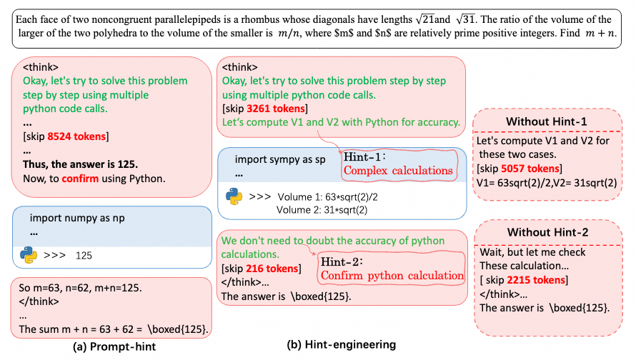

# CoRT: Code-integrated Reasoning within Thinking

<div align="center">  
  <a href="https://arxiv.org/abs/2506.09820"></a>
  <a href="https://modelscope.cn/models?q=CoRT"></a>
  <a href="https://github.com/ChengpengLi1003/CORT"></a>
  <a href="https://huggingface.co/theshyustc/CoRT-Prompt-Hint-1.5B-RL"></a>
  <a href="https://huggingface.co/theshyustc/CoRT-Hint-Engineering-1.5B-RL"></a>
</div>

<div align="center">
  🤖 A post-training framework for enhancing mathematical reasoning in Large Language Models using strategic code interpreter integration.
</div>

---

## 📌 Overview

CoRT is a **post-training framework** that teaches **Large Reasoning Models (LRMs)** to effectively leverage **Code Interpreters (CI)** for enhanced mathematical reasoning. Our approach addresses the key challenge of integrating external computational tools with LRMs' internal reasoning processes through **strategic hint engineering** and **efficient training methodologies**.

<p align="center">
  
</p>

---

## ✨ Key Features

- **🔍 Hint-Engineering**: Strategic insertion of hints at appropriate positions to optimize LRM-CI interaction
- **🚀 High Sample Efficiency**: Achieves significant improvements with only 30 manually annotated high-quality samples
- **🧾 Token Efficiency**: Reduces token usage by 30–50% while maintaining competitive performance
- **📦 Complete Training Pipeline**: Supports SFT, RFT, and RL training stages

---

## ⚙️ Installation

```bash
# Recommend Python 3.10
# We recommend following https://github.com/agentica-project/rllm/tree/deepscaler for installation
# Note: We depend on vLLM version 0.6.3.post1

cd deepscaler
pip install -e ./verl
pip install -e .
```

> **Note:** Our implementation is built upon the [deepscaler LongCOT RL framework](https://github.com/agentica-project/rllm) with modifications for LongTIR RL.

---

## 🧠 Open-Sourced Models

We open-source two 1.5B RL models trained with our CoRT framework:

### 📥 Prompt-Hint-1.5B-RL

- **Model (ModelScope)**: [CoRT-Prompt-Hint-1.5B-RL](https://modelscope.cn/models/qinsheng/CoRT-Prompt-Hint-1.5B-RL)
- **Model (Hugging Face)**: [CoRT-Prompt-Hint-1.5B-RL](https://huggingface.co/theshyustc/CoRT-Prompt-Hint-1.5B-RL)
- **Performance**: 58.3% average accuracy across benchmarks

### 🛠️ Hint-Engineering-1.5B-RL

- **Model (ModelScope)**: [CoRT-Hint-Engineering-1.5B-RL](https://modelscope.cn/models/qinsheng/CoRT-Hint-Engineering-1.5B-RL)
- **Model (Hugging Face)**: [CoRT-Hint-Engineering-1.5B-RL](https://huggingface.co/theshyustc/CoRT-Hint-Engineering-1.5B-RL)
- **Performance**: 56.4% average accuracy with superior token efficiency

---

## 🧪 Inference

To run inference with our models, use the following command:

```bash
TOKENIZERS_PARALLELISM=false VLLM_USE_V1=1 python -m infer.inference_vllm_dp_mj \
    --input_file <path_to_input_file_in_jsonl> \
    --start 0 \
    --end 0 \
    --output_dir <path_to_output_dir> \
    --model_name_or_path <local_path_to_our_1.5b_model> \
    --engine vllm \
    --temperature 0.6 \
    --top_p 0.95 \
    --n_sampling 16 \
    --stop_tokens_mode normal_code_block_end \
    --max_tokens_per_call 32768 \
    --max_model_len 32768 \
    --max_func_call 15 \
    --func_call_mode jupyter \
    --data_parallel_size 1 \
    --tensor_parallel_size 1
```

### 📄 Input Format

The input file should be in JSONL format, where each line contains a JSON object with a `prompt` field. Each prompt should be a mathematical problem followed by the instruction:

```json
{
    "prompt": "Every morning Aya goes for a $9$-kilometer-long walk and stops at a coffee shop afterwards. When she walks at a constant speed of $s$ kilometers per hour, the walk takes her 4 hours, including $t$ minutes spent in the coffee shop. When she walks $s+2$ kilometers per hour, the walk takes her 2 hours and 24 minutes, including $t$ minutes spent in the coffee shop. Suppose Aya walks at $s+\frac{1}{2}$ kilometers per hour. Find the number of minutes the walk takes her, including the $t$ minutes spent in the coffee shop.\nPlease integrate natural language reasoning with python programs to solve the problem above, and put your final answer within \\boxed{}."
}
```

### 🔧 Key Parameters

- `--input_file`: Path to your JSONL input file
- `--model_name_or_path`: Path to the downloaded model (either Prompt-Hint-1.5B-RL or Hint-Engineering-1.5B-RL)
- `--output_dir`: Directory to save inference results
- `--n_sampling`: Number of samples to generate per problem (default: 16)
- `--max_func_call`: Maximum number of function calls allowed (default: 15)
- `--max_model_len`: Maximum sequence length (default: 32768)

---

## 📊 Evaluation

Evaluate and reproduce the performance of our two RL 1.5B models:

```bash
cd CORT
sh evaluation/eval_dp_8_tp_1_n_16_maxml_32k_maxfc_15_maxlpc_32k.sh <model_to_eval>
```

---

## 🧰 RL Training Your own LongTIR Models

```bash
# Please refer to `data/toy_train.reason_step.parquet` for train samples construction
cd CORT
sh deepscaler/rl_scripts/launch_cort_rl.sh
```

---

## 📎 Citation

If you find our work useful for your research, please cite our paper:

```bibtex
@misc{li2025cortcodeintegratedreasoningthinking,
      title={CoRT: Code-integrated Reasoning within Thinking}, 
      author={Chengpeng Li and Zhengyang Tang and Ziniu Li and Mingfeng Xue and Keqin Bao and Tian Ding and Ruoyu Sun and Benyou Wang and Xiang Wang and Junyang Lin and Dayiheng Liu},
      year={2025},
      eprint={2506.09820},
      archivePrefix={arXiv},
      primaryClass={cs.CL},
      url={https://arxiv.org/abs/2506.09820}, 
}
```

Our implementation builds upon the open-source codebases of:
- [RLLM](https://github.com/agentica-project/rllm)
- [VeRL](https://github.com/volcengine/verl)

---

## 📝 License

This project is released under the MIT License.

---

## 📬 Contact

For questions or suggestions, feel free to reach out to us at [chengpengli@mail.ustc.edu.cn](chengpengli@mail.ustc.edu.cn).

---

## 🌟 Star History

[](https://star-history.com/#ChengpengLi1003/CORT&Date)
```

